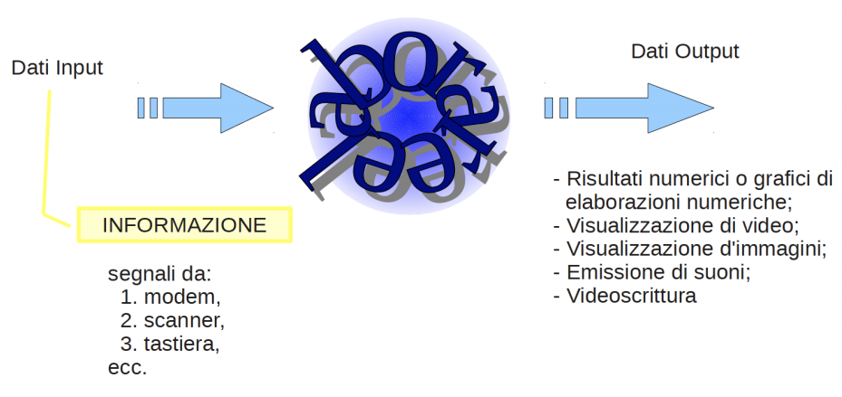
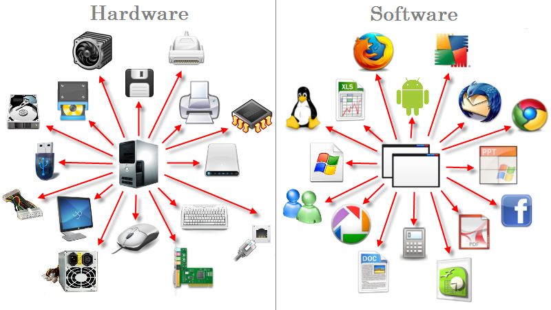

# Welcome 

Informatica per tutt@

---

### Cosa significa "Informatica"?

- Nasce dall'unione di due parole, INFOrmazione e autoMATICA
- E' una scienza che si occupa della gestione dei dati e delle informazioni

---

### Che cos'è un computer?

- E' un sistema che elabora informazione digitale

---

### Hardware e software

- Hardware: insieme dei componenti meccanici, elettronici e fisici

- Software: programmi e applicazioni

---
### Hardware e software

---
### Sistema Operativo

- Un sistema operativo (abbreviato in SO) è un insieme di componenti software che consente l'utilizzo di varie apparecchiature informatice (ad esempio un computer) da parte di un utente

- Esempi di sistemi operativi sono **Windows**, **Linux**, **iOS**, **Android** ...

 ---
### Sistema Operativo

- Garantisce il funzionamento di un calcolatore
- Coordina e gestice le risorse di sistema (CPU e memoria primaria) e delle componenti hardware che costituiscono il computer (periferiche di Input/Output)

- Esegue i programmi e le applicazioni

- Gestice archiviazione e accesso ai file

---

### Sistema Operativo: Esempi

- Windows

---
### Sistema Operativo: Esempi

- OSX

---
### Sistema Operativo: Esempi

- Linux (Ubuntu)

---

### Hardware

E' costituito da:

- Dispositivi di input
- Dispositivi di output
- Supporti di memorizzazione

---

### Hardware: CPU

- E' il cervello del computer. Si divide in due parti:
  - CU (Control Unit): organizza e controlla i dispositivi e ordina le istruzioni da eseguire
  - ALU (Arithmetic Logic Unit): si occupa del calcolo

- La velocità della CPU si misura in Mhz

---
### Hardware: CPU

---

### Hardware: Memoria

- Serve per la memorizzazione dei dati

  - *Memoria Primaria* (o centrale): molto veloce, costosa, dimensioni inferiori
  - Lavora direttamente con il microprocessore
    - RAM, ROM

  - *Memoria Secondaria* (o di massa): dispositivi non a stretto contatto con il processore, servono per immagazzinare dati. Meno veloce, grande capacità di dati
    - hard disk, cd, dvd, chiavetta usb

---

### Hardware: Memoria, Unita' di misura

- **Bit**: cifra elementare che può assumere solo due valori, 0 oppure 1
  -- Per esempio, la sequenza  **01000001** in codice binario è usata per indicare la lettera A

- **Byte**: sequenza di 8 bit

- **1 KiloByte (1 KB)**: 1.000 Byte

- **1 MegaByte (1 MB)**: 1.000.000 Byte

- **1 GigaByte (1 GB)**: 1.000.000.000 Byte

- **1 TeraByte (1 TB)**: 1.000.000.000.000 Byte

---
### Hardware: Periferiche 

- Input: insieme di dispositivi capaci di immettere dati nel computer

- Output: ricevono i dati dal computer e li convertono in modo da poter essere leggibili

---

### Hardware: Periferiche di INPUT

- Mouse
- Tastiera
- Touchpad
- Macchina fotografica
- Scanner
- Microfono
- Webcam

---

### Hardware: Periferiche di OUTPUT

- Monitor
- Stampante
- Proiettore
- Casse

---
