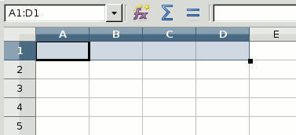
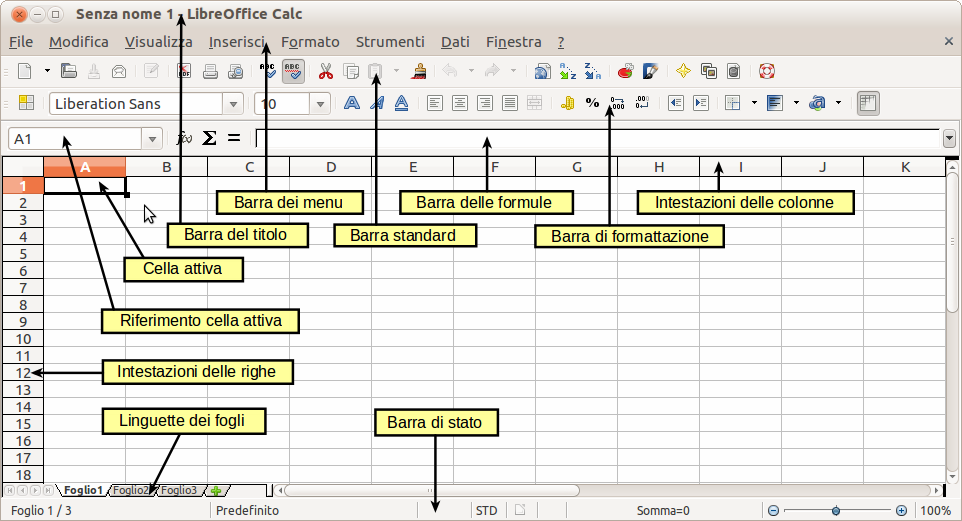
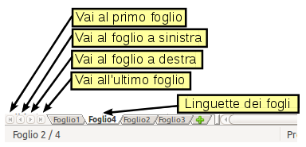
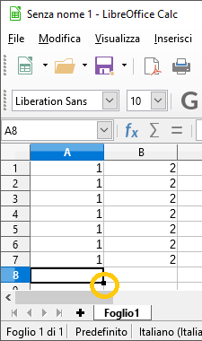
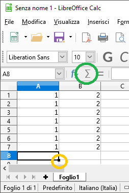

# Welcome 

#### Informatica per tutt@
#### Primo approccio ai fogli elettronici

---

### Cosa sono

- Programmi per effettuare calcoli
	- LibreOffice Calc - libero e gratuito
	- Google Sheets - online e gratuito
	- Office Excel - a pagamento
- Utili a creare grafici

Note:
- Chiamati anche fogli di calcolo

---

### Struttura

- Foglio/Tabella
	- Cella
		- Valore/Formula

Note:
Una cella può contenere:
- numero
- testo
- formula o funzione utilizzando i valori di altre celle

---

### LibreOffice Calc

---

### Inserimento valori

- Selezione casella **A1**
- Scrittura numero `1`
- Copia/Incolla  
	*`Ctrl+C` e `Ctrl+V` funzionano anche qui!*
	1. subito sotto
	1. su selezione di più celle
- Selezione intera colonna
- Copiate colonna **A** su colonna **B**

---
### Salvataggio

#### Salvate spesso, salvate subito!

---

### Fogli

- Create nuovo foglio
- Spostatevi tra i due fogli

---

@snap[west]
### Riempimento Testo

@ul
- Scrivete `casa` in **A1**
- Selezionate **A1**
- Trascinate in basso  con strumento *Riempimento*
@ulend
@snapend

@snap[east]

@snapend

Note:
Sul secondo foglio
	
---

### Altri Riempimenti
	
- Numeri: Scrivete `1` e `2` in **B1** e **B2**
	- Selezionate i numeri e usate **Riempimento**
- Date: Scrivete una data in **C1**
	- Selezionate e usate **Riempimento**

	
---

@snap[west]
### Inserimento funzioni

@ul
- Selezionate cella vuota
- Premete **Σ**
- Trascinate a destra  usando **Riempimento**
@ulend
@snapend

@snap[east]

@snapend

Note:
Sul primo foglio

---

Grafico

...

---

### Riferimenti

- [Guida LibreOffice](https://wiki.documentfoundation.org/images/3/3c/GS35-Guida_introduttiva_a_LibreOffice_3.5.pdf)

