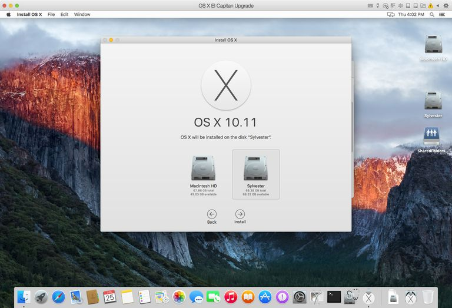
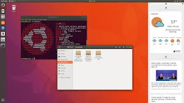
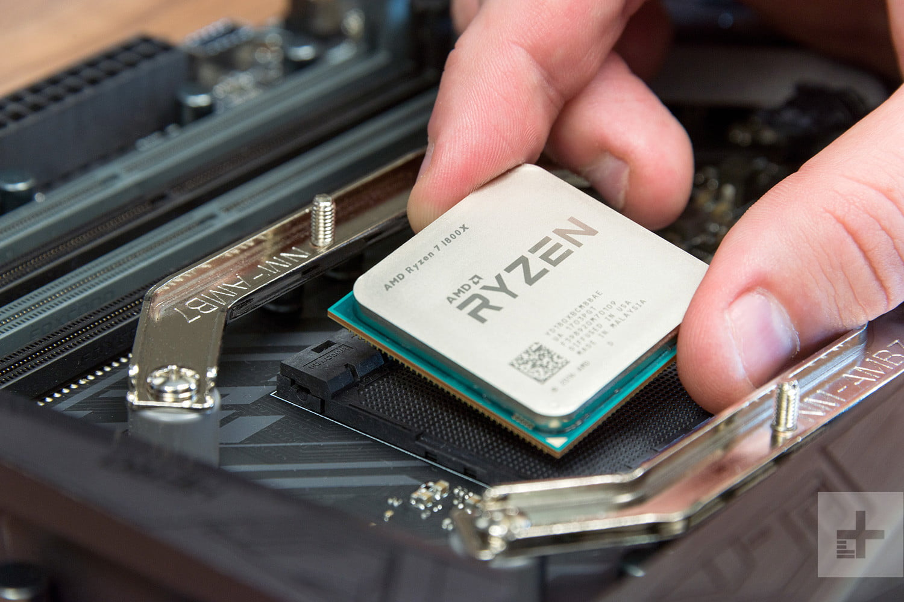
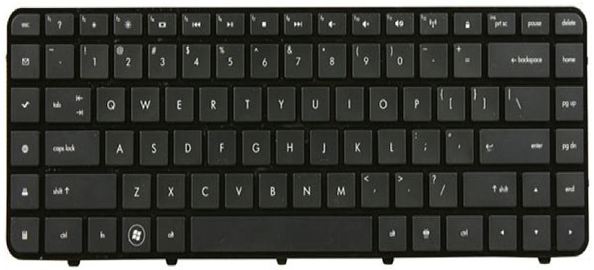
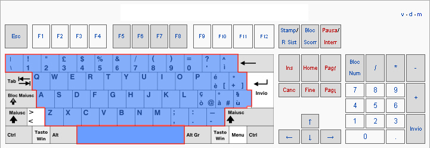
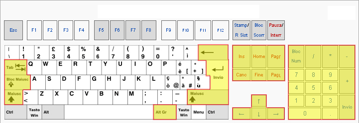
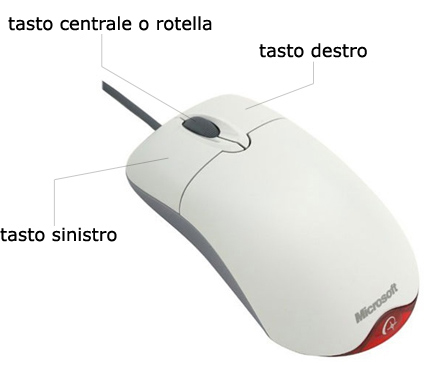
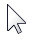

# Welcome 

Informatica per tutt@

---

### Cosa significa "Informatica"?

- Nasce dall'unione di due parole, INFOrmazione e autoMATICA
- E' una scienza che si occupa della gestione dei dati e delle informazioni

---

### Che cos'è un computer?

- E' un sistema che elabora informazione digitale

---

### Hardware e software

- Hardware: insieme dei componenti meccanici, elettronici e fisici

- Software: programmi e applicazioni

---
### Hardware e software

---
### Sistema Operativo

- Un sistema operativo (abbreviato in SO) è un insieme di componenti software che consente l'utilizzo di varie apparecchiature informatice (ad esempio un computer) da parte di un utente

- Esempi di sistemi operativi sono **Windows**, **Linux**, **iOS**, **Android** ...

---

### Sistema Operativo

- Garantisce il funzionamento di un calcolatore
- Coordina e gestice le risorse di sistema (CPU e memoria primaria) e delle componenti hardware che costituiscono il computer (periferiche di Input/Output)

- Esegue i programmi e le applicazioni

- Gestice archiviazione e accesso ai file

---

### Sistema Operativo: Esempi

- Windows

---
### Sistema Operativo: Esempi

- OSX

---
### Sistema Operativo: Esempi

- Linux (Ubuntu)

---

### Hardware

E' costituito da:

- Dispositivi di input
- Dispositivi di output
- Supporti di memorizzazione

---

### Hardware: CPU

- E' il cervello del computer. Si divide in due parti:
  - CU (Control Unit): organizza e controlla i dispositivi e ordina le istruzioni da eseguire
  - ALU (Arithmetic Logic Unit): si occupa del calcolo

- La velocità della CPU si misura in Mhz

---
### Hardware: CPU

---

### Hardware: Memoria

- Serve per la memorizzazione dei dati

  - *Memoria Primaria* (o centrale): molto veloce, costosa, dimensioni inferiori
  - Lavora direttamente con il microprocessore
    - RAM, ROM

  - *Memoria Secondaria* (o di massa): dispositivi non a stretto contatto con il processore, servono per immagazzinare dati. Meno veloce, grande capacità di dati
    - hard disk, cd, dvd, chiavetta usb

---

### Hardware: Memoria, Unita' di misura

- **Bit**: cifra elementare che può assumere solo due valori, 0 oppure 1
  -- Per esempio, la sequenza  **01000001** in codice binario è usata per indicare la lettera A

- **Byte**: sequenza di 8 bit

- **1 KiloByte (1 KB)**: 1.000 Byte

- **1 MegaByte (1 MB)**: 1.000.000 Byte

- **1 GigaByte (1 GB)**: 1.000.000.000 Byte

- **1 TeraByte (1 TB)**: 1.000.000.000.000 Byte

---
### Hardware: Periferiche 

- Input: insieme di dispositivi capaci di immettere dati nel computer

- Output: ricevono i dati dal computer e li convertono in modo da poter essere leggibili

---

### Hardware: Periferiche di INPUT

- Mouse
- Tastiera
- Touchpad
- Macchina fotografica
- Scanner
- Microfono
- Webcam

---

### Hardware: Periferiche di OUTPUT

- Monitor
- Stampante
- Proiettore
- Casse

---

### Tastiera

- La tastiera italiana standard è composta di 105 tasti

- La distribuzione delle lettere non rispetta l'ordine alfabetico
  - tastiera *QWERTY* (le lettere dei primi 6 tasti) è pensata per fare in modo che ogni dito abbia più o meno lo stesso carico
  
  
  
---
### Tasti con funzioni speciali

- *Windows*: apre il menu Start.
- *Esc*: sta per Escape (Uscita, in inglese), e normalmente chiude l’applicazione o la finestra in cui ti trovi, o ti fa uscire dalla modalità a schermo intero di un programma.
- *Menu*: è il penultimo tasto in basso a destra del blocco principale della tastiera. Equivale al tasto destro del mouse (argomento che approfondiremo tra poco), quindi apre il menu contestuale.
- *F1*: apre il menu Aiuto.
     
---

### Tasti di scrittura

- Sono quelli che contengono tutte le lettere, i numeri, le lettere accentate, i simboli più usati quando si scrive (per esempio i segni di punteggiatura, l’asterisco e l’apostrofo); il tasto grande che si trova al centro in basso è la barra di spazio. Qui sopra sono tutti evidenziati in blu.   
  
---

### Tasti di scrittura complementari

Sono quelli evidenziati in giallo.

- *Tab* (due frecce una sopra l’altra): inserisce nel testo uno spazio in base a “salti” predeterminati.  

- *Bloc Maiusc*: serve a bloccare la tastiera sulla modalità lettere maiuscole; con una pressione si attiva, con un’altra pressione si disattiva.

- *Shift* (o Maiusc): se digiti una qualsiasi lettera mentre tieni premuto questo tasto ottieni una lettera maiuscola, mentre se assieme ad esso digiti un tasto con due simboli disegnati otterrai quello più in alto.

---

### Tasti di scrittura complementari

- *Alt Gr*: se lo schiacci assieme ad un tasto con tre simboli disegnati, otterrai quello che si trova in basso a destra. Ad esempio, per ottenere la chiocciola che si usa negli indirizzi email (@) devi schiacciare Alt Gr e il tasto ò (“o” accentata).

- *Cancella*: è il tasto che si trova sopra quello di Invio (nella parte principale della tastiera), e ha disegnata sopra una freccia rivolta a sinistra; serve a cancellare il carattere che si trova immediatamente a sinistra del cursore.

- *Canc*: fa l’opposto del tasto precedente: cancella il carattere che si trova immediatamente a destra del cursore.

- *Invio*: è il tasto più grande di tutta la tastiera dopo la barra spaziatrice, e serve per andare a capo quando scrivi e per confermare i comandi che dai al computer.
  
---

### Mouse

E' il modo più immediato per comunicare con il PC

- trasferisce i movimenti dalla tua mano al mondo virtuale del computer
  

---
### Mouse

- Pulsante sinistro: attraverso il click sinistro puoi selezionare oggetti, chiudere finestre, schiacciare bottoni

- Pulsante destro: serve per accedere a funzioni secondarie nascoste	

- La rotellina centrale serve a scorrere il contenuto della finestra
  
---

### Il Cursose

 

- E' una specie di estensione naturale della tua mano

Esempi:

- In questi casi vuol dire che il computer sta pensando

---

### Il cursore

- In questo caso vuol dire che il cursore è in un punto in cui è presente un link

- In questo caso vuol dire che l'oggetto sopra il quale si trova il cursore può essere spostato

### Desktop

- Il Desktop, In italiano, "scrivania", è l'area dello schermo su cui appaiono le icone e le finestre rappresentanti le memorie di massa collegate al computer ed il loro contenuto.

---