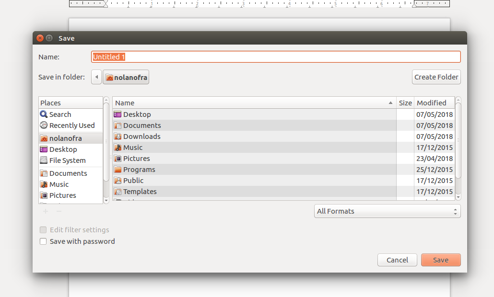
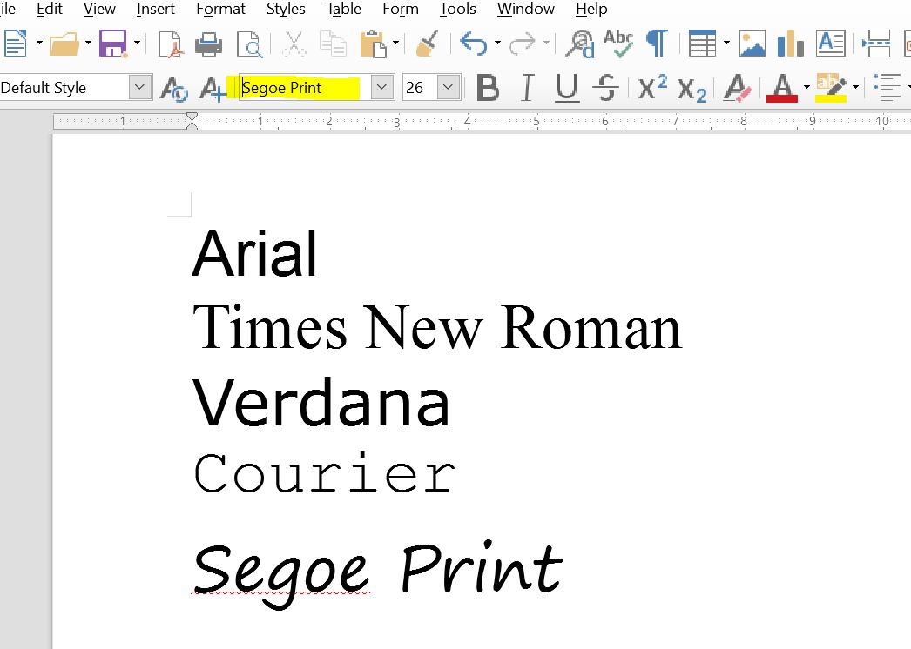
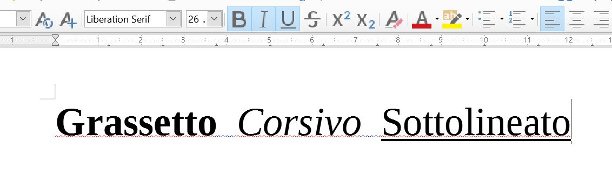
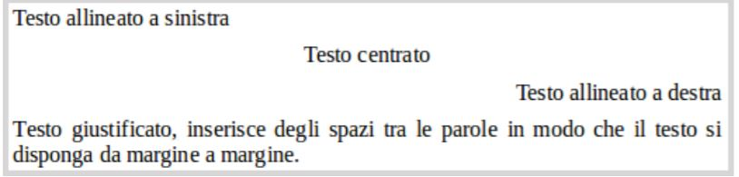
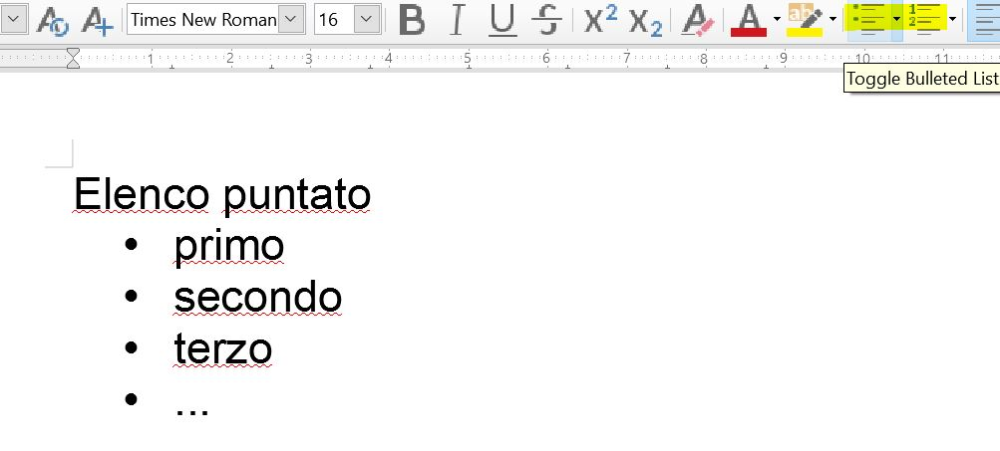
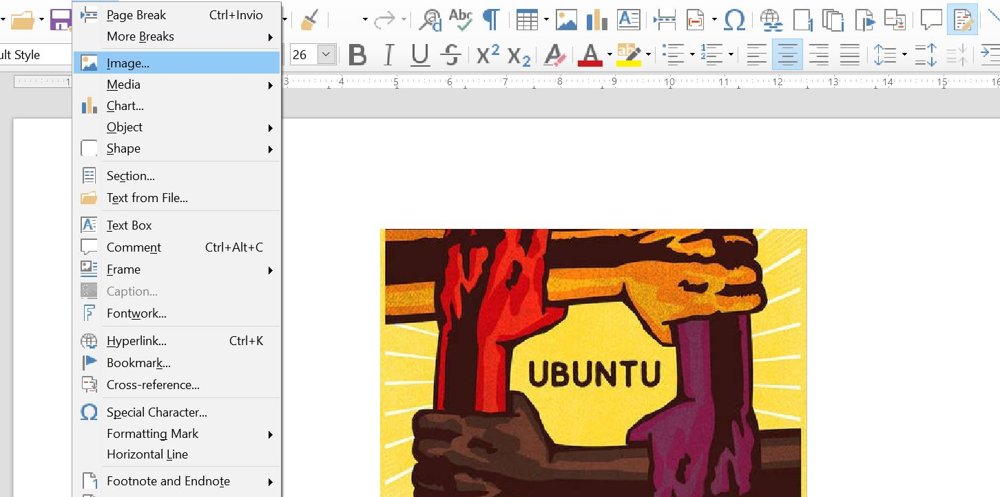
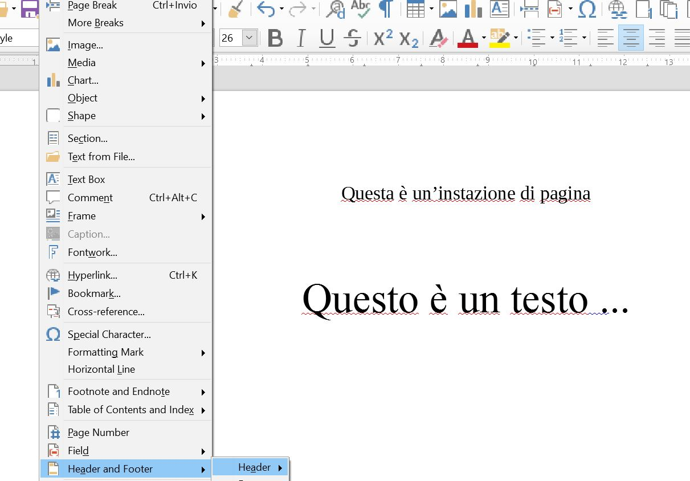
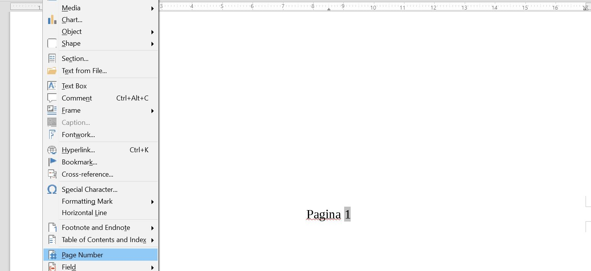
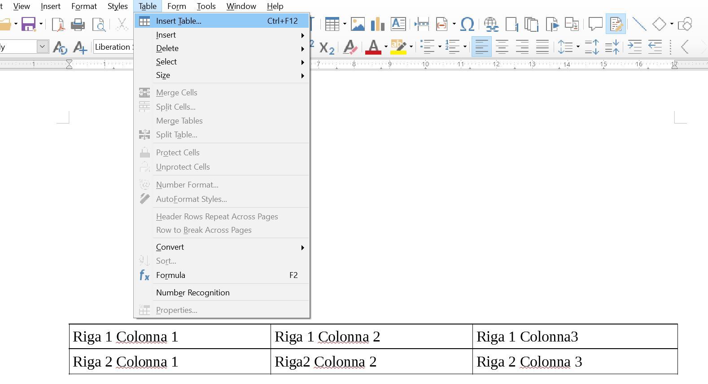
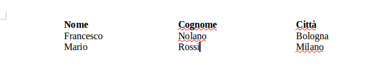

# Welcome 

Informatica per tutt@

Corso di VideoScrittura

---

### Inserimento testo

- Barra spaziatrice, tasto Invio, tasto shift, tasto caps, tasto canc	

---

### Salvare un file di testo

- Menu file
  - Salva vs Salva con nome
  - Finestra di dialogo

---

### Selezione testo

- Selezione tramite mouse

- Selezione tramite ctrl-frecce
  - Copia / incolla / taglia

- Per spostare (tagliare e incollare) il testo selezionato, usate Ctrl+X per tagliare il testo, portate il
cursore nella posizione in cui volete incollare e usate Ctrl+V per incollare.

---

### Tipi di carattere

- Font

---

### Formati carattere

- Grassetto, corsivo, sottolineato 

- Cambia colore, dimensione, tipo di carattere

---
### Formato paragrafo

- Allineamento a sinistra, destra, centrato, giustificato

- Interlinea

---

### Elenco puntato

---

### Formato pagina

---

### Immagini

---

### Formato paragrafo

- Rientro paragrafo, rientro prima riga

---

### Intestazioni e piè di pagina

- Le intestazioni sono una parte del documento inserita sempre nella parte alta della pagina

---
### Piè di pagina

- I piè di pagina sono inseriti sempre nella parte bassa della pagina

---

### Tabelle
- Le tabelle sono un mezzo comodo per organizzare e presentare grandi quantità di informazioni

---

### Tabulazioni

- Tasto tab
- Visualizza righello 
  - Aggiungi tabulazioni a righello
  - Scrivere in colonne

---
